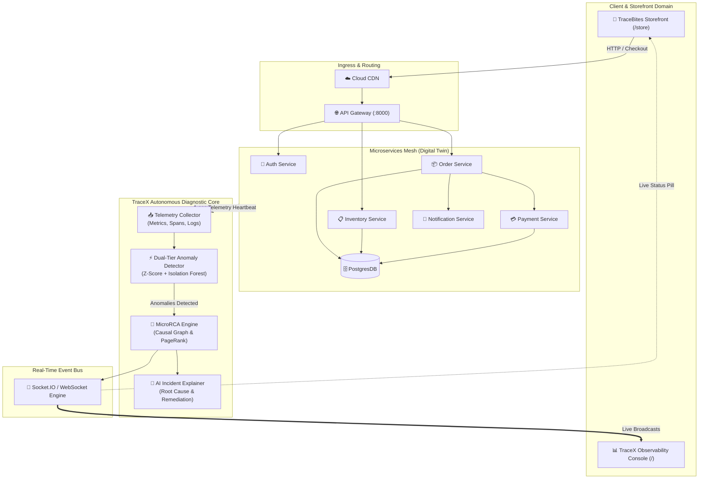

# 🔍 TraceX — Autonomous Distributed Microservices RCA Engine

<div align="center">


[](https://nextjs.org/)
[](https://fastapi.tiangolo.com/)
[](https://python.org/)
[](https://www.typescriptlang.org/)
[](https://tailwindcss.com/)
[](https://pytest.org/)

**TraceX** is an autonomous, real-time **Root Cause Analysis (RCA)** and failure diagnosis platform for distributed microservices. Powered by an algorithmic **MicroRCA** engine (PageRank-inspired causal graph traversal), dynamic telemetry synthesis, and an interactive DAG topology visualizer with an integrated consumer-facing food storefront demo (**TraceBites**).

[Architecture](#-system-architecture) • [Key Features](#-key-features) • [Demo Walkthrough](#-live-demo-walkthrough) • [Quickstart](#-getting-started) • [API Reference](#-api-endpoints)

</div>

---

## ⚡ The Problem: Cascading Failures in Microservices

In modern distributed microservice architectures:
- **A single failure cascades**: A database connection pool exhaustion in `postgres-db` causes latency spikes in `order-service`, which creates a backlog in `api-gateway`, which triggers 504 timeouts for end-users on the frontend.
- **Alert Fatigue**: SREs receive dozens of simultaneous alerts across multiple services. 95% of these are *symptoms*, not the *root cause*.
- **High MTTR (Mean Time to Resolution)**: Engineers spend 45+ minutes manually correlating logs, traces, and metrics across disparate dashboards before identifying the culprit.

**TraceX solves this autonomously in <2 seconds.**

---

## 🚀 Key Features

### 1. 🕸️ Live Service Dependency Topology (DAG)
- Interactive, GPU-accelerated dependency graph powered by `@xyflow/react` and Dagre hierarchical layout.
- Real-time animated telemetry pipelines connecting 8 distributed services:
  - `CDN` $\rightarrow$ `API Gateway` $\rightarrow$ `Auth`, `Order`, `Inventory` $\rightarrow$ `Payment`, `Notification`, `PostgresDB`.
- **Dynamic Propagation Highlighting**: Nodes and connecting pipelines automatically change color in real-time (🟢 Healthy $\rightarrow$ 🟡 Degraded $\rightarrow$ 🔴 Critical) as cascading failures propagate through the mesh.

### 2. 🧠 Algorithmic MicroRCA Engine
- **PageRank-Inspired Causal Graph Traversal**: Computes personalized random walks with restart across the runtime service call graph.
- **Self-Time Anomaly Decomposition**: Disentangles downstream wait latency from internal processing latency to isolate the true originating bottleneck.
- **Confidence Scoring & Anomaly Ranking**: Emits pinpoint root cause identification with statistical confidence scores (typically 90–95%).

### 3. 🤖 AI-Powered Incident Explanations
- Autonomous incident synthesis providing human-readable explanations of why the incident occurred.
- Actionable step-by-step remediation commands (e.g. `ALTER SYSTEM SET max_connections = 300;`, restarting crashed pods, or circuit breaker policy adjustments).

### 4. 🍕 TraceBites Live Customer Storefront (`/store`)
- A consumer-facing food delivery website demonstrating live **Cause & Effect**:
  - Browse artisan burgers, pizzas, and ramen; add to cart; and proceed to checkout.
  - **Dual-Path Checkout**:
    - **Normal Checkout**: Request smoothly traverses microservices with <30ms latency.
    - **Simulate Buggy Checkout**: Intentionally triggers chaos scenarios directly from the checkout modal to watch TraceX diagnose the failure in real time.

### 5. 💥 Chaos Engineering Control Panel
- 5 pre-configured enterprise failure scenarios:
  1. **Database Overload**: Connection pool exhaustion causing cascading upstream timeouts.
  2. **Auth Service Crash**: Authorization container failure causing all authenticated requests to fail.
  3. **Network Partition**: Payment gateway unreachable, triggering retry storms.
  4. **Memory Leak**: Inventory service OOM with prolonged Garbage Collection pauses.
  5. **CDN Latency Spike**: Edge cache degradation causing global latency spikes.

---

## 🏗️ System Architecture



---

## 📂 Project Structure

```
BitnBuild/
├── backend/                         # FastAPI & Python Analytics Core
│   ├── analysis/                    # RCA & Anomaly Detection Algorithms
│   │   ├── anomaly_detector.py      # Statistical Z-Score & Isolation Forest detector
│   │   ├── explainer.py             # AI remediation & incident narrative generator
│   │   ├── impact_analyzer.py       # User & downstream service blast-radius analysis
│   │   ├── propagation_tracer.py    # Temporal cascade correlation tracer
│   │   └── rca_engine.py            # MicroRCA causal graph PageRank engine
│   ├── api/                         # REST Endpoints & Socket.IO Handler
│   │   ├── routes.py                # Service metrics, graph, order checkout & chaos routes
│   │   └── websocket.py             # Real-time telemetry broadcast handlers
│   ├── ingestion/                   # Telemetry synthesis & collector
│   ├── simulator/                   # Digital twin state evolution & chaos injector
│   ├── store/                       # Sliding-window time series & graph storage
│   ├── tests/                       # 15 automated pytest unit & integration tests
│   ├── config.py                    # Environment & runtime settings
│   └── main.py                      # FastAPI application entrypoint & worker heartbeat
│
├── frontend/                        # Next.js 16 App Router (Turbopack)
│   ├── src/
│   │   ├── app/
│   │   │   ├── layout.tsx           # Global HTML layout & dark theme styling
│   │   │   ├── globals.css          # Tailwind CSS v4 & React Flow custom animation styles
│   │   │   ├── page.tsx             # TraceX SRE Observability Dashboard (/)
│   │   │   └── store/page.tsx       # TraceBites Food Delivery Storefront (/store)
│   │   ├── components/
│   │   │   ├── DependencyGraph/     # React Flow DAG with custom nodes & animated edges
│   │   │   ├── RootCausePanel/      # RCA result cards, confidence rings & propagation steps
│   │   │   ├── MetricsDashboard/    # Real-time sparkline cards (latency, errors, req/s, CPU)
│   │   │   ├── IncidentTimeline/    # Chronological event timeline
│   │   │   ├── ControlPanel/        # Chaos engineering fault injection buttons
│   │   │   ├── AIExplanation/       # AI diagnostic narrative & bash remediation cards
│   │   │   ├── Header.tsx           # Navigation bar with live SRE status pill
│   │   │   └── Store/               # TraceBites customer storefront components
│   │   │       ├── StoreNavbar.tsx
│   │   │       ├── CategoryPills.tsx
│   │   │       ├── ProductCard.tsx
│   │   │       ├── CartDrawer.tsx
│   │   │       ├── CheckoutModal.tsx
│   │   │       └── OrderOutcomeModal.tsx
│   │   ├── hooks/
│   │   │   ├── useDashboard.ts      # WebSocket & REST telemetry synchronization
│   │   │   └── useCart.ts           # Food ordering cart & checkout state management
│   │   ├── lib/
│   │   │   ├── constants.ts         # Service definitions & default baseline metrics
│   │   │   ├── socket.ts            # Socket.IO client singleton
│   │   │   └── store-data.ts        # 16+ artisan food menu catalog
│   │   └── types/                   # Strict TypeScript domain interfaces
│   ├── package.json
│   └── next.config.ts
```

---

## 🔬 How the MicroRCA Algorithm Works

TraceX implements the state-of-the-art **MicroRCA** algorithm adapted for distributed service meshes:

1. **Dual-Tier Anomaly Detection**:
   - Computes rolling mean and standard deviation over sliding telemetry windows (30s).
   - Flags anomalies when metrics exceed dynamic thresholds ($\mu \pm 2.5\sigma$) or when error rates spike $> 5\%$.
   - Complemented by an Isolation Forest for multivariate anomaly detection.

2. **Causal Dependency Graph Construction**:
   - Builds an attributed directed graph $G = (V, E)$ from runtime distributed traces and service dependencies.
   - Vertices represent services; edges represent network call relationships.

3. **Self-Time Decomposition**:
   - For any service $S_i$, its response latency $T(S_i)$ is decomposed into:
     $$T_{\text{self}}(S_i) = T(S_i) - \sum_{S_j \in \text{Downstream}(S_i)} T(S_j)$$
   - If $T(S_i)$ increases but $T_{\text{self}}(S_i)$ is normal, $S_i$ is merely a victim of downstream delay. If $T_{\text{self}}(S_i)$ spikes, $S_i$ is an anomaly originator.

4. **Personalized PageRank Traversal**:
   - Computes random walks with restart biased by anomaly scores and call correlation weights:
     $$\mathbf{p} = (1 - \alpha) \mathbf{W}^T \mathbf{p} + \alpha \mathbf{s}$$
   - The stationary probability vector $\mathbf{p}$ ranks services by their probability of being the true root cause.

---

## 🎬 Live Demo Walkthrough

### Scenario: Database Connection Pool Exhaustion

1. **Step 1: Open Dual Windows**
   - Left Window: `http://localhost:3000/store` (TraceBites Food App)
   - Right Window: `http://localhost:3000` (TraceX Observability Console)

2. **Step 2: Place an Order with a Bug**
   - On TraceBites, add the *Smoked Truffle Smash Burger* to cart and click **Proceed to Checkout**.
   - In the checkout modal, choose **"Simulate: Database Overload"** and click **Place Order with Simulated Bug**.

3. **Step 3: Instant Cascading Failure & Root Cause Localization**
   - **Customer Screen**: Checkout fails with *"504 Gateway Timeout: Database pool saturated"*.
   - **TraceX Dashboard**:
     - `postgres-db` turns **flashing red** on the topology graph.
     - Red animated dashed failure lines propagate upward through `order-service` to `api-gateway`.
     - **MicroRCA Panel** displays:
       - **Root Cause**: `postgres-db` (Confidence: 94%)
       - **Propagation Path**: `postgres-db` $\rightarrow$ `order-service` $\rightarrow$ `api-gateway`
       - **AI Remediation**: *"Connection pool saturated. Scale pool size or run `ALTER SYSTEM SET max_connections = 300;`"*.

4. **Step 4: System Reset**
   - Click **"System Reset"** on the dashboard.
   - All services return to healthy green baselines.

---

## 🛠️ Getting Started

### Prerequisites
- **Node.js** 18.0+ and **npm**
- **Python** 3.10+ and **pip**

### 1. Clone the Repository
```bash
git clone https://github.com/Bored008/TraceX.git
cd TraceX
```

### 2. Start the FastAPI Backend
```bash
# Optional: create virtual environment
python -m venv venv
venv\Scripts\activate       # Windows
# source venv/bin/activate  # macOS/Linux

# Install dependencies
pip install -r requirements.txt

# Start backend server on port 8000
uvicorn backend.main:app --host 0.0.0.0 --port 8000 --reload
```

Verify backend health: [http://localhost:8000/api/health](http://localhost:8000/api/health)

### 3. Start the Next.js Frontend
In a separate terminal:
```bash
cd frontend
npm install
npm run dev
```

Open your browser:
- **TraceX SRE Console**: [http://localhost:3000](http://localhost:3000)
- **TraceBites Food Store**: [http://localhost:3000/store](http://localhost:3000/store)

---

## 🧪 Automated Testing

### Backend Unit & Integration Tests (15 Tests)
```bash
python -m pytest backend/tests -v
```
Tests cover:
- Z-Score latency anomaly detection
- Error rate spike detection
- Isolation Forest multivariate analysis
- MicroRCA root cause localization for DB overload
- Weakly connected components for concurrent multi-point failures
- Digital Twin fault injection & reset cycles

### Frontend Production Build Verification
```bash
cd frontend
npm run build
```
Compiles with Turbopack, validates TypeScript types, and outputs optimized static routes `/` and `/store`.

---

## 🔌 API Endpoints

| Method | Endpoint | Description |
| :--- | :--- | :--- |
| `GET` | `/api/health` | Backend status and list of currently active faults |
| `GET` | `/api/services` | Real-time snapshot of all 8 services with live metrics & history |
| `GET` | `/api/graph` | Full service topology nodes, dependencies & edge latency baselines |
| `GET` | `/api/anomalies` | Recently detected statistical anomalies |
| `GET` | `/api/incidents` | Historical and active RCA incident reports |
| `POST` | `/api/order/checkout` | Customer food checkout (supports `simulateFaultScenario`) |
| `POST` | `/api/chaos/inject` | Inject fault scenario (`db_overload`, `payment_crash`, etc.) |
| `POST` | `/api/chaos/reset` | Clear all active faults and return mesh to baseline |

---

## 🧰 Tech Stack

| Domain | Technology | Purpose |
| :--- | :--- | :--- |
| **Frontend Framework** | Next.js 16 (App Router) | High-performance React framework with Turbopack |
| **UI Library** | React 19 + TypeScript | Type-safe reactive component development |
| **Styling** | Tailwind CSS v4 | Dark-mode native utility-first responsive styling |
| **Topology Graph** | `@xyflow/react` (React Flow 12) | Interactive DAG visualization with custom SVG edge shaders |
| **Layout Engine** | `@dagrejs/dagre` | Directed acyclic graph hierarchical node positioning |
| **Charts** | Recharts | Sparklines and live telemetry area charts |
| **Icons** | Lucide React | Modern minimalist iconography |
| **Backend Framework** | FastAPI (Python 3.13) | Asynchronous high-throughput REST API |
| **Real-Time Transport** | Python-SocketIO | Low-latency bi-directional WebSocket telemetry streaming |
| **Graph Analytics** | NetworkX | Causal dependency graphs and PageRank computation |
| **Data Processing** | NumPy + Scikit-learn | Multivariate Isolation Forest and sliding-window statistics |
| **Testing** | Pytest | Rigorous unit and regression test suite |

---

## 📄 License
This project is licensed under the MIT License — see the [LICENSE](LICENSE) file for details.

---

<div align="center">
  <b>Built for BitnBuild 2026 • Powered by Autonomous MicroRCA</b>
</div>
