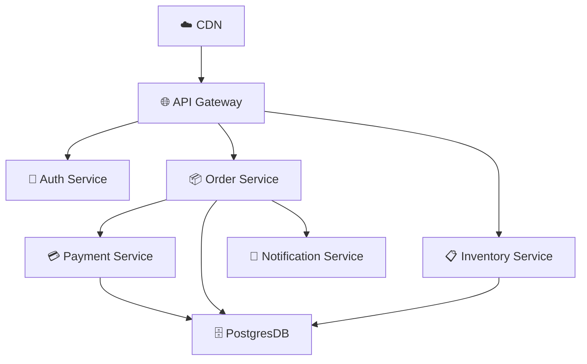
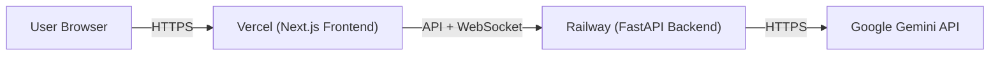

# TraceX – Implementation Plan v2

## Intelligent Distributed System Root Cause Analyzer

---

## Goal

Build **TraceX** in ~24 hours: an intelligent Root Cause Analysis system that detects failures in distributed applications, identifies where the failure **actually started** (not just where errors appeared), traces the **propagation path**, assesses **impact**, and provides **AI-powered explanations**.

### Demo Moment
```
1. Dashboard shows 7 healthy microservices with live traffic flowing
2. Click "Inject: Database Overload"
3. Watch failure propagate visually: DB → Order → API Gateway (nodes turn red sequentially)
4. TraceX automatically diagnoses:
   ┌──────────────────────────────────────────────────┐
   │ 🔴 Root Cause: PostgresDB (connection pool       │
   │    exhaustion) — Confidence: 91%                  │
   │                                                   │
   │ 📍 Propagation: DB → Order Service → API Gateway  │
   │ 💥 Impact: 4 services / ~2,300 users affected     │
   │                                                   │
   │ 🤖 AI Explanation: "The database connection pool  │
   │    reached 100% capacity at 14:23:05, causing     │
   │    Order Service queries to queue. P99 latency    │
   │    spiked from 120ms to 4,200ms after 8 seconds,  │
   │    triggering API Gateway timeout errors..."       │
   │                                                   │
   │ 🔧 Suggested Fix: Increase connection pool size   │
   │    from 20 to 100, add connection timeout, and    │
   │    implement circuit breaker pattern.              │
   └──────────────────────────────────────────────────┘
```

---

## Architecture

```mermaid
flowchart TD
    subgraph Frontend["🖥️ Next.js Dashboard (Vercel)"]
        RF["React Flow — Live Dependency Graph"]
        RC["Recharts — Metrics Sparklines"]
        RCP["Root Cause Panel + AI Explanation"]
        TL["Incident Timeline"]
        CP["Chaos Control Panel"]
    end

    subgraph Backend["⚙️ FastAPI Backend (Railway)"]
        SIM["Digital Twin Simulator"]
        FI["Fault Injector (5 Scenarios)"]
        ING["Telemetry Ingestion"]
        TS["Time-Series Store (In-Memory)"]
        DG["NetworkX Dependency Graph"]
        AD["Anomaly Detector (Z-Score + Isolation Forest)"]
        RCA["MicroRCA Engine (Self-Time + PageRank)"]
        IA["Impact Analyzer"]
        EX["Gemini AI Explainer"]
    end

    SIM -->|OTel spans, metrics, logs| ING
    FI -->|inject fault| SIM
    ING --> TS
    TS --> AD
    AD -->|anomalies| RCA
    DG --> RCA
    RCA --> IA
    RCA --> EX

    Backend -->|WebSocket (Socket.IO)| Frontend
    Frontend -->|REST API| Backend
    CP -->|POST /api/chaos/inject| FI
```

---

## Tech Stack

| Layer | Technology | Why |
|-------|-----------|-----|
| **Frontend** | Next.js 14 + TypeScript + Tailwind CSS | Fast setup, your existing skills, Vercel deployment |
| **Graph Viz** | React Flow (`@xyflow/react`) | Best React DX, custom nodes, animated edges, Dagre layout |
| **Charts** | Recharts | Simple, React-native, good time-series sparklines |
| **Backend** | Python + FastAPI | Async WebSockets, auto Swagger docs, fast to build |
| **Graph Algorithms** | NetworkX | Personalized PageRank, graph traversal, dependency modeling |
| **Anomaly Detection** | scikit-learn (Isolation Forest) + numpy | Production-grade ML, trains in <200ms |
| **Real-time** | python-socketio | WebSocket streaming to frontend |
| **AI Explanations** | Google Gemini API | Natural language root cause explanations + fix suggestions |
| **Deployment** | Vercel (frontend) + Railway (backend) | Free tier, fast deploy, custom domains |

---

## Resolved Decisions

> [!NOTE]
> - **Team size**: 3 members — work split defined below
> - **Backend**: Python FastAPI (installing Python + pip)
> - **AI**: Gemini API for explanations (with template-based fallback)
> - **Deployment**: Vercel (Next.js) + Railway (FastAPI)
> - **Simulation**: Single-process digital twin (no Docker needed)
> - **Data store**: In-memory (no database setup)

---

## Open Questions

> [!IMPORTANT]
> **Team member skills**: What are the strengths of your 3 team members? I've proposed a split below, but we can adjust based on who's comfortable with what.

> [!NOTE]
> **Project name display**: Should the dashboard say "TraceX" or do you have a specific logo/brand in mind?

---

## Team Task Split (3 Members)

### 👤 Member A — Backend Engineer (Simulator + Analysis Engine)
Owns the entire Python backend: simulator, anomaly detection, RCA algorithm, API.

| Phase | Hours | Tasks |
|-------|-------|-------|
| Setup | 0-1 | Install Python, FastAPI, dependencies. Project scaffold. |
| Simulator | 1-5 | Build 7-service digital twin, telemetry generator, 5 fault scenarios |
| Analysis | 5-10 | Anomaly detector (Z-score + IsoForest), MicroRCA (self-time + PageRank) |
| Integration | 10-13 | WebSocket streaming, REST API, impact analyzer |
| AI | 13-15 | Gemini API integration for explanations |
| Polish | 15-18 | Handle imperfect data, concurrent failures, edge cases |
| Deploy | 18-20 | Railway deployment |

### 👤 Member B — Frontend Engineer (Dashboard + Visualization)
Owns the entire Next.js dashboard: React Flow graph, metrics, panels.

| Phase | Hours | Tasks |
|-------|-------|-------|
| Setup | 0-1 | Next.js + Tailwind + React Flow scaffold |
| Graph | 1-6 | Live dependency graph with custom ServiceNode, animated edges, Dagre layout |
| Dashboard | 6-11 | Metrics grid (Recharts sparklines), root cause panel, incident timeline |
| Controls | 11-13 | Chaos control panel, fault injection buttons |
| Real-time | 13-16 | Socket.IO integration, live updates, state management |
| Polish | 16-20 | Animations, dark theme, responsive design, loading states |
| Deploy | 20-22 | Vercel deployment |

### 👤 Member C — Full-Stack + Integration + Demo
Bridges backend and frontend, handles shared types, integration testing, and demo preparation.

| Phase | Hours | Tasks |
|-------|-------|-------|
| Setup | 0-2 | Monorepo setup, shared types, Git repo, CI basics |
| Bridge | 2-6 | API client layer, Socket.IO client hooks, type definitions |
| Testing | 6-10 | End-to-end integration testing, fix cross-layer bugs |
| Features | 10-14 | Impact summary component, propagation path animation, AI explanation panel |
| Imperfect Data | 14-17 | Event buffer for late/missing events, concurrent failure handling |
| Demo | 17-20 | Demo script, README, screen recording, edge case testing |
| Deploy | 20-22 | End-to-end deployment testing, environment variables |
| Pitch | 22-24 | Practice pitch, prepare slides if needed |

---

## Project Structure

```
BitnBuild/
├── README.md
├── .gitignore
├── .env.example
│
├── backend/                          # Python FastAPI
│   ├── requirements.txt
│   ├── main.py                       # FastAPI app entry + Socket.IO
│   ├── config.py                     # Settings, thresholds, Gemini key
│   │
│   ├── simulator/
│   │   ├── __init__.py
│   │   ├── service_graph.py          # 7-service topology definition
│   │   ├── digital_twin.py           # Service simulation engine
│   │   ├── telemetry_generator.py    # OTel-format span/metric/log generation
│   │   └── fault_injector.py         # 5 chaos scenarios
│   │
│   ├── ingestion/
│   │   ├── __init__.py
│   │   ├── collector.py              # Receives telemetry from simulator
│   │   └── event_buffer.py           # Handles delayed/out-of-order events
│   │
│   ├── store/
│   │   ├── __init__.py
│   │   ├── time_series.py            # In-memory sliding window store
│   │   └── graph_store.py            # NetworkX dependency graph
│   │
│   ├── analysis/
│   │   ├── __init__.py
│   │   ├── anomaly_detector.py       # Z-Score + Isolation Forest
│   │   ├── rca_engine.py             # MicroRCA: self-time + PageRank
│   │   ├── propagation_tracer.py     # Reconstruct failure path
│   │   ├── impact_analyzer.py        # Affected services + users
│   │   └── explainer.py              # Gemini AI + template fallback
│   │
│   ├── api/
│   │   ├── __init__.py
│   │   ├── routes.py                 # REST endpoints
│   │   └── websocket.py              # Socket.IO event handlers
│   │
│   └── tests/
│       ├── test_anomaly_detector.py
│       ├── test_rca_engine.py
│       └── test_simulator.py
│
├── frontend/                         # Next.js 14
│   ├── package.json
│   ├── next.config.js
│   ├── tailwind.config.ts
│   ├── tsconfig.json
│   │
│   ├── src/
│   │   ├── app/
│   │   │   ├── layout.tsx
│   │   │   ├── page.tsx              # Main dashboard page
│   │   │   └── globals.css
│   │   │
│   │   ├── components/
│   │   │   ├── DependencyGraph/
│   │   │   │   ├── DependencyGraph.tsx    # React Flow canvas
│   │   │   │   ├── ServiceNode.tsx        # Custom node with health ring
│   │   │   │   ├── ServiceEdge.tsx        # Custom animated edge
│   │   │   │   └── graph-layout.ts        # Dagre auto-layout
│   │   │   │
│   │   │   ├── RootCausePanel/
│   │   │   │   ├── RootCausePanel.tsx     # Main RCA display
│   │   │   │   ├── ConfidenceRing.tsx     # Circular confidence gauge
│   │   │   │   └── PropagationPath.tsx    # Step-by-step failure path
│   │   │   │
│   │   │   ├── MetricsDashboard/
│   │   │   │   ├── MetricsGrid.tsx        # Grid of metric cards
│   │   │   │   └── MetricCard.tsx         # Single metric sparkline
│   │   │   │
│   │   │   ├── IncidentTimeline/
│   │   │   │   └── IncidentTimeline.tsx   # Chronological event list
│   │   │   │
│   │   │   ├── ImpactSummary/
│   │   │   │   └── ImpactSummary.tsx      # Affected services/users
│   │   │   │
│   │   │   ├── AIExplanation/
│   │   │   │   └── AIExplanation.tsx      # Gemini-powered explanation
│   │   │   │
│   │   │   ├── ControlPanel/
│   │   │   │   └── ControlPanel.tsx       # Chaos injection buttons
│   │   │   │
│   │   │   └── Header.tsx
│   │   │
│   │   ├── hooks/
│   │   │   ├── useSocket.ts               # Socket.IO connection + events
│   │   │   ├── useMetrics.ts              # Metrics state
│   │   │   └── useIncidents.ts            # Incident state
│   │   │
│   │   ├── lib/
│   │   │   ├── socket.ts                  # Socket.IO client init
│   │   │   ├── api.ts                     # REST API client (fetch)
│   │   │   └── constants.ts               # Service colors, icons, etc.
│   │   │
│   │   └── types/
│   │       ├── telemetry.ts               # Shared type definitions
│   │       ├── incident.ts
│   │       └── service.ts
│   │
│   └── public/
│       └── favicon.ico
│
└── docs/
    └── demo-script.md                # Step-by-step demo instructions
```

---

## Component Details

---

### 1. Service Topology (`backend/simulator/service_graph.py`)

7 microservices modeling an e-commerce platform:



Each service has baseline parameters:

| Service | Baseline Latency | Error Rate | Throughput | CPU | Memory |
|---------|-----------------|------------|------------|-----|--------|
| CDN | 5ms | 0.01% | 500 rps | 10% | 20% |
| API Gateway | 15ms | 0.1% | 450 rps | 25% | 30% |
| Auth Service | 20ms | 0.05% | 200 rps | 15% | 25% |
| Order Service | 45ms | 0.2% | 150 rps | 35% | 40% |
| Payment Service | 80ms | 0.3% | 100 rps | 20% | 30% |
| Inventory Service | 30ms | 0.1% | 180 rps | 25% | 35% |
| Notification Service | 25ms | 0.05% | 120 rps | 10% | 20% |
| PostgresDB | 8ms | 0.01% | 300 rps | 40% | 50% |

---

### 2. Fault Injection Scenarios (`backend/simulator/fault_injector.py`)

5 pre-built one-click scenarios:

#### Scenario 1: Database Connection Pool Exhaustion
```
Trigger:   DB connection pool → 100%
Effect:    DB latency 8ms → 4000ms, error rate → 30%
Cascade:   DB → Order Service (queries queue, latency 45ms → 5000ms)
           → API Gateway (timeouts, error rate 0.1% → 25%)
Timeline:  DB fails at T+0s, Order degrades at T+8s, Gateway errors at T+15s
```

#### Scenario 2: Auth Service Crash
```
Trigger:   Auth Service process dies
Effect:    Auth latency → timeout, error rate → 100%
Cascade:   Auth → API Gateway (all authenticated requests fail)
           → All downstream services (no traffic)
Timeline:  Auth crashes at T+0s, Gateway 401s at T+3s
```

#### Scenario 3: Payment Service Network Partition
```
Trigger:   Payment Service becomes unreachable
Effect:    Payment error rate → 100% (connection refused)
Cascade:   Payment → Order Service (circuit breaker trips)
           → API Gateway (order creation fails)
Timeline:  Payment partitioned at T+0s, Order fails at T+5s
```

#### Scenario 4: Inventory Memory Leak
```
Trigger:   Inventory memory usage creeps 35% → 95% over 60 seconds
Effect:    GC pauses cause latency spikes (30ms → 2000ms intermittently)
Cascade:   Inventory → API Gateway (inventory checks slow)
Timeline:  Gradual degradation, first anomaly at T+30s
```

#### Scenario 5: CDN Latency Spike (Cascading Timeout)
```
Trigger:   CDN latency 5ms → 800ms
Effect:    All requests through CDN are slow
Cascade:   CDN → Gateway → all services see increased latency
Timeline:  CDN degrades at T+0s, system-wide impact at T+5s
```

---

### 3. Anomaly Detection — Dual Tier (`backend/analysis/anomaly_detector.py`)

#### Tier 1: Streaming Z-Score (Real-Time)

For each service, for each metric, maintain a 60-second rolling window:

$$Z = \frac{x_t - \mu_{\text{rolling}}}{\sigma_{\text{rolling}}}$$

Detection rules:
- **Latency anomaly**: $Z_{\text{latency}} > 3.0$
- **Error rate spike**: $Z_{\text{error}} > 2.5$ OR error rate > $5 \times$ baseline
- **Throughput drop**: $Z_{\text{rps}} < -2.5$

Severity mapping:
| Z-Score | Severity |
|---------|----------|
| 2.5 – 3.0 | `LOW` |
| 3.0 – 4.0 | `MEDIUM` |
| 4.0 – 5.0 | `HIGH` |
| > 5.0 | `CRITICAL` |

#### Tier 2: Isolation Forest (Multi-Dimensional)

Feature vector per service per window:
$$\vec{x} = [\text{p50\_latency}, \text{p95\_latency}, \text{error\_rate}, \text{rps}, \text{cpu\_pct}]$$

- Train on first 2 minutes of baseline data
- `IsolationForest(contamination=0.05, n_estimators=100)`
- Outputs anomaly score $\in [0.0, 1.0]$
- Catches **multivariate anomalies** that Z-score misses (e.g., latency normal but error rate + memory both abnormal)

---

### 4. Root Cause Analysis — MicroRCA Algorithm (`backend/analysis/rca_engine.py`)

This is the **core innovation** of TraceX. Three-step process:

#### Step 1: Span Self-Time Decomposition

In distributed traces, a service's total duration includes waiting for child RPCs:

$$\text{SelfTime}(u) = \text{Duration}(u) - \sum_{v \in \text{children}(u)} \text{Duration}(v)$$

**Key insight**: When PostgresDB stalls, Order Service and API Gateway both show high *total time*, but their *self-time* is near zero (they're idle, waiting). The **root cause** node has anomalously high self-time.

```python
def compute_self_time(span, child_spans):
    child_duration = sum(c.duration for c in child_spans)
    return max(0, span.duration - child_duration)
```

#### Step 2: Temporal Change-Point (First-to-Fail)

Identify the earliest timestamp where an anomaly occurred. The node with the earliest change point gets a priority boost.

```python
def temporal_priority(anomaly, all_anomalies):
    earliest = min(a.timestamp for a in all_anomalies)
    latest = max(a.timestamp for a in all_anomalies)
    span = latest - earliest if latest > earliest else 1
    return 1.0 - (anomaly.timestamp - earliest) / span
```

#### Step 3: Personalized PageRank on Anomaly Graph

```python
import networkx as nx

def find_root_cause(anomalies, dependency_graph):
    # Build weighted anomaly graph
    G = nx.DiGraph()
    
    for service in anomalies:
        G.add_node(service.id, weight=compute_node_score(service))
    
    for u, v in dependency_graph.edges():
        if u in anomalies and v in anomalies:
            delay = anomalies[v].timestamp - anomalies[u].timestamp
            G.add_edge(u, v, weight=1.0 / max(delay, 0.001))
    
    # Personalization: start from symptom nodes (downstream services with errors)
    symptom_weights = {n: 1.0 for n in get_symptom_nodes(G)}
    
    # PageRank finds the node that "caused" the most impact
    scores = nx.pagerank(G, personalization=symptom_weights, weight='weight')
    
    root_cause = max(scores, key=scores.get)
    confidence = scores[root_cause] * 100
    
    return root_cause, confidence
```

Node scoring:
$$S(u) = 0.4 \cdot \text{SelfTimeAnomaly}(u) + 0.3 \cdot \text{ErrorRate}(u) + 0.2 \cdot \text{IsolationScore}(u) + 0.1 \cdot \text{TemporalPriority}(u)$$

---

### 5. Handling Imperfect Data

The problem statement says: *"Some logs may be missing, events may arrive late, and more than one problem may happen at the same time."*

#### Missing Events
- If a gap exists in the causal chain (A → ? → C), use the dependency graph to **infer the missing link**
- Adjust confidence score downward proportionally:
  $\text{confidence} \times (1 - 0.15 \times \text{missing\_links})$

#### Late-Arriving Events
- `EventBuffer` holds events for 5 seconds before processing
- Events arriving within the buffer window are inserted in correct temporal order
- Events arriving after the window trigger **re-analysis** of recent incidents

#### Multiple Concurrent Failures
- Decompose the anomaly graph into **connected components** using NetworkX
- Each component is analyzed independently → separate incidents
- UI shows multiple concurrent incidents side by side

```python
def handle_concurrent_failures(anomaly_graph):
    components = nx.weakly_connected_components(anomaly_graph)
    incidents = []
    for component in components:
        subgraph = anomaly_graph.subgraph(component)
        incident = analyze_single_incident(subgraph)
        incidents.append(incident)
    return incidents
```

---

### 6. AI Explainer (`backend/analysis/explainer.py`)

Uses Google Gemini to generate human-readable explanations:

```python
prompt = f"""You are a distributed systems expert analyzing a production incident.

Root Cause Service: {root_cause.service_id}
Root Cause Metric: {root_cause.metric} = {root_cause.value} (normal: {root_cause.baseline})
Anomaly Time: {root_cause.timestamp}
Confidence: {confidence}%

Propagation Path:
{propagation_path}

Affected Services: {affected_services}
Estimated Affected Users: {affected_users}

Provide:
1. A clear 2-3 sentence explanation of what happened and why
2. The causal chain in plain English
3. A suggested fix (1-2 sentences)

Be concise and technical but readable."""
```

**Fallback** (no API key): Template-based explanation engine:
```
"{service} experienced {metric} anomaly at {time}, reaching {value} 
(normal baseline: {baseline}). This caused {downstream} to {effect} 
approximately {delay}ms later..."
```

---

### 7. REST API Endpoints (`backend/api/routes.py`)

| Method | Endpoint | Description |
|--------|----------|-------------|
| `GET` | `/api/services` | Get all services with current health status |
| `GET` | `/api/services/{id}/metrics` | Get metrics history for a service |
| `GET` | `/api/graph` | Get dependency graph (nodes + edges) |
| `GET` | `/api/incidents` | Get all detected incidents |
| `GET` | `/api/incidents/{id}` | Get detailed RCA result for incident |
| `POST` | `/api/chaos/inject` | Inject a fault scenario `{scenario: "db_overload"}` |
| `POST` | `/api/chaos/reset` | Reset all services to healthy |
| `GET` | `/api/health` | Backend health check |

### 8. WebSocket Events (`backend/api/websocket.py`)

| Event | Direction | Payload | Description |
|-------|-----------|---------|-------------|
| `metrics:update` | Server → Client | `{serviceId, metrics}` | Real-time metric updates (every 1s) |
| `service:health` | Server → Client | `{serviceId, status}` | Service health status change |
| `anomaly:detected` | Server → Client | `{anomaly}` | New anomaly detected |
| `incident:created` | Server → Client | `{incident}` | New incident (group of anomalies) |
| `rca:completed` | Server → Client | `{rcaResult}` | Root cause analysis result |
| `chaos:injected` | Server → Client | `{scenario}` | Fault scenario activated |
| `chaos:reset` | Server → Client | `{}` | All services reset |

---

### 9. Dashboard Components

#### ServiceNode (React Flow Custom Node)

```
┌──────────────────────────┐
│  ┌──┐                    │
│  │🗄️│  PostgresDB        │← Service icon + name
│  └──┘                    │
│  ●━━━━━━━━━━━━━━━━━━━●   │← Health ring (green/yellow/red)
│                          │
│  Latency   8ms    ✓      │← Key metrics
│  Errors    0.01%  ✓      │
│  RPS       300    ✓      │
│  CPU       40%    ✓      │
└──────────────────────────┘

When anomaly detected:
┌──────────────────────────┐
│  ┌──┐                    │
│  │🗄️│  PostgresDB   🔴   │← Red pulse animation
│  └──┘                    │
│  ●━━━━━━━━━━━━━━━━━━━●   │← Red health ring
│                          │
│  Latency   4200ms  ⚠️    │← Anomalous metrics highlighted
│  Errors    30%     🔴    │
│  RPS       45      ⬇️    │
│  CPU       98%     🔴    │
└──────────────────────────┘
```

#### Dashboard Layout

```
┌─────────────────────────────────────────────────────────────────┐
│  🔍 TraceX      [System Status: ● Healthy]     [Dark/Light] ⚙️ │
├─────────────────────────────────────────────────────────────────┤
│                                                                 │
│  ┌──────────────────────────────┐ ┌───────────────────────────┐ │
│  │                              │ │  ROOT CAUSE ANALYSIS      │ │
│  │    LIVE DEPENDENCY GRAPH     │ │                           │ │
│  │    (React Flow)              │ │  🔴 PostgresDB            │ │
│  │                              │ │  Connection pool exhaust. │ │
│  │    [CDN] ──► [Gateway]       │ │                           │ │
│  │              │  │  │         │ │  Confidence ████████░ 91% │ │
│  │         [Auth] [Order] [Inv] │ │                           │ │
│  │              │    │          │ │  Propagation:             │ │
│  │         [Pay] [DB] [Notif]   │ │  DB ──► Order ──► Gateway │ │
│  │                              │ │                           │ │
│  │  Nodes pulse when affected   │ │  Impact:                  │ │
│  │  Edges animate traffic flow  │ │  4 services / 2,300 users │ │
│  └──────────────────────────────┘ └───────────────────────────┘ │
│                                                                 │
│  ┌──────────────────────────────────────────────────────────┐   │
│  │  METRICS  [API Gateway ▼]                                │   │
│  │  ┌──────────┐ ┌──────────┐ ┌──────────┐ ┌──────────┐    │   │
│  │  │ P99 Lat  │ │ Error %  │ │   RPS    │ │   CPU    │    │   │
│  │  │  ▁▂▃▅█  │ │  ▁▁▁▅█  │ │  █▅▃▂▁  │ │  ▁▂▃▅█  │    │   │
│  │  │  4200ms │ │   25%    │ │   120    │ │   92%    │    │   │
│  │  └──────────┘ └──────────┘ └──────────┘ └──────────┘    │   │
│  └──────────────────────────────────────────────────────────┘   │
│                                                                 │
│  ┌───────────────────────────┐ ┌──────────────────────────────┐ │
│  │  📋 INCIDENT TIMELINE     │ │  🎛️ CONTROL PANEL            │ │
│  │                           │ │                              │ │
│  │  14:23:05 🔴 DB overload  │ │  [💥 DB Overload        ]   │ │
│  │  14:23:13 🟡 Order slow   │ │  [🔐 Auth Crash         ]   │ │
│  │  14:23:18 🔴 GW errors    │ │  [🌐 Network Partition  ]   │ │
│  │  14:23:19 🤖 RCA: DB is   │ │  [💾 Memory Leak        ]   │ │
│  │     root cause (91%)      │ │  [☁️  CDN Latency Spike  ]   │ │
│  │                           │ │  [🔄 Reset All Services ]   │ │
│  │  🤖 AI: "The database..." │ │                              │ │
│  └───────────────────────────┘ └──────────────────────────────┘ │
└─────────────────────────────────────────────────────────────────┘
```

---

## Implementation Timeline (24 Hours)

```mermaid
flowchart LR
    subgraph Phase1["Phase 1: Setup (0-2h)"]
        A1["Member A: Install Python, FastAPI scaffold"]
        B1["Member B: Next.js + Tailwind + React Flow scaffold"]
        C1["Member C: Git repo, shared types, .env, README"]
    end

    subgraph Phase2["Phase 2: Core Build (2-10h)"]
        A2["Member A: Simulator (7 services, telemetry gen, 2 fault scenarios)"]
        B2["Member B: Dependency graph (React Flow + custom nodes + Dagre)"]
        C2["Member C: API client, Socket.IO hooks, type definitions"]
    end

    subgraph Phase3["Phase 3: Brain (10-16h)"]
        A3["Member A: Anomaly detector + RCA engine + WebSocket streaming"]
        B3["Member B: Metrics grid + Root cause panel + Timeline"]
        C3["Member C: Integration testing + Impact panel + AI explanation UI"]
    end

    subgraph Phase4["Phase 4: Polish (16-22h)"]
        A4["Member A: Remaining 3 fault scenarios + Gemini AI + imperfect data"]
        B4["Member B: Animations, dark theme, responsive, propagation animation"]
        C4["Member C: End-to-end testing, deployment (Vercel + Railway)"]
    end

    subgraph Phase5["Phase 5: Demo (22-24h)"]
        A5["All: Bug fixes, demo rehearsal, pitch prep"]
    end

    Phase1 --> Phase2 --> Phase3 --> Phase4 --> Phase5
```



---

## Deployment Architecture



**Vercel**: Frontend deployed via `vercel --prod` or GitHub integration
**Railway**: Backend deployed via `railway up` with `Procfile` or `railway.json`

Environment variables needed:
```bash
# Backend (.env)
GEMINI_API_KEY=your_key_here
CORS_ORIGINS=https://your-app.vercel.app
PORT=8000

# Frontend (.env.local)
NEXT_PUBLIC_API_URL=https://your-backend.railway.app
NEXT_PUBLIC_WS_URL=https://your-backend.railway.app
```

---

## Dependencies

### Backend (`requirements.txt`)
```
fastapi==0.115.*
uvicorn[standard]==0.34.*
python-socketio==5.*
networkx==3.*
scikit-learn==1.*
numpy==2.*
google-generativeai==0.8.*
pydantic==2.*
python-dotenv==1.*
```

### Frontend (`package.json` key deps)
```json
{
  "@xyflow/react": "^12",
  "recharts": "^2",
  "socket.io-client": "^4",
  "tailwindcss": "^4",
  "lucide-react": "^0.400",
  "@dagrejs/dagre": "^1"
}
```

---

## Verification Plan

### Automated Tests
```bash
# Backend unit tests
cd backend && python -m pytest tests/ -v

# Key test cases:
# - Z-score correctly flags anomaly when value > 3σ from mean
# - Isolation Forest detects multivariate anomaly
# - MicroRCA identifies DB as root cause in DB overload scenario
# - Self-time decomposition correctly attributes time to root cause
# - PageRank scores root cause highest
# - Event buffer correctly reorders late events
# - Connected components separate concurrent failures
```

### Manual End-to-End Verification

1. **Start system**: Backend + Frontend running
2. **Healthy state**: All 7 nodes green, metrics stable for 30 seconds
3. **Inject DB Overload**: Click button → observe:
   - DB node turns red within ~5s
   - Order node turns yellow → red within ~10s
   - API Gateway turns yellow/red within ~15s
   - Anomaly notifications appear in timeline
   - RCA panel shows "PostgresDB" as root cause
   - Confidence score displayed (~85-95%)
   - Propagation path: DB → Order → Gateway
   - AI explanation generated
4. **Reset**: Click reset → all services return to green
5. **Repeat** with Auth Crash and Network Partition scenarios
6. **Test imperfect data**: Verify system handles gracefully when events are delayed

### Demo Dry Run
1. Show healthy system (15s)
2. Inject DB overload — watch propagation animate (20s)
3. TraceX identifies root cause (10s)
4. Walk through RCA panel + AI explanation (30s)
5. Reset + inject Auth crash for second demo (30s)
6. Highlight: "We handle missing data and concurrent failures" (15s)
7. Total: ~2 minutes
